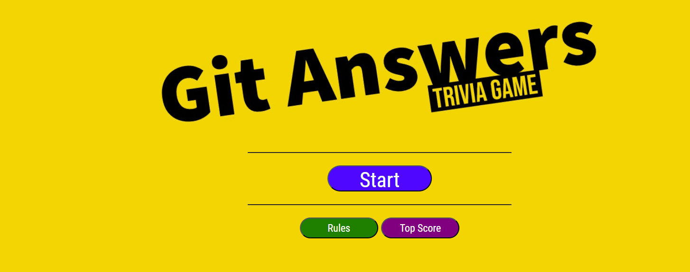
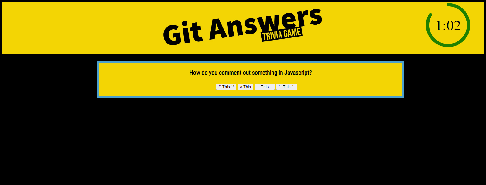

# 04 Web APIs: Code Quiz

## Git Answers

On the main screen are three buttons to start the game, read the rules, and view the top scores.

There is validation to check for a high score and, if there isn't one:
-It will say, "There isn't a top player yet!"
-It will record the next player with ANY score EXCEPT 0.

After clicking the Start button, it will prompt for the player's name.

There are 5 questions and a timer of 75 seconds.

When the player answers, a correct or incorrect symbol will briefly appear.

If a question is missed, the timer will lose 10 seconds, but those seconds can be recovered:

As an extra layer, there are 2 bonus questions that will randomly appear. If answered correctly, each one recovers 10 seconds.

Off to the right will be results so you know if you got the last question right or wrong.

The clock is an animated element with a border that rotates and as it gets closer to 0, the color changes.

At the end, a score will show a score.

5 correct = 100%
4 correct = 80%
3 correct = 60%
2 correct = 40%
1 correct = 20%
0 correct = 0%

Below the score will be a fun rank.

100% - Admiral
80% - Captain
60% - Commander
40% - Lieutenant
20% - Ensign
0% - Cadet

## Mock-Up

## Link

Repo: https://github.com/Coridane/game
Website: https://coridane.github.io/game

Sources

I drew a lot of ideas from this code, but I combined it with ideas from my password generator's code:

https://www.shecodes.io/athena/59004-how-to-create-a-standard-quiz-with-html-css-and-javascript

I found this code to make an animated clock and learned most of it (not done tinkering) and I made it my own by changing some things:

https://css-tricks.com/how-to-create-an-animated-countdown-timer-with-html-css-and-javascript/

